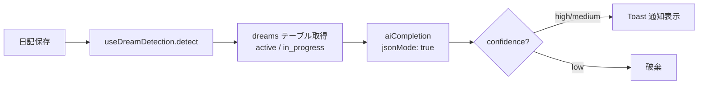

# 夢進捗検出

> 最終更新: 2026-04-05 | ソースコード: `src/hooks/useDreamDetection.ts`

## 概要

日記エントリの内容とユーザーの夢リストを照合し、夢の達成に近づいた可能性をLLMで検出する機能。検出結果は Toast 通知で即座に表示され、DBには保存しない。

## アーキテクチャ図



## 入力データ

| データソース | テーブル/API | 取得件数 | 用途 |
|---|---|---|---|
| 日記本文 | (引数として渡される) | 1件 | 照合対象テキスト |
| 夢リスト | `dreams` (id, title, description) | status が `active` または `in_progress` の全件 | 照合元 |

## 処理フロー

### Step 1: データ収集

夢リストを Supabase から取得:

```sql
SELECT id, title, description FROM dreams
WHERE status IN ('active', 'in_progress')
```

夢が0件の場合は空配列を返して終了。

### Step 2: プロンプト構築

**システムプロンプト:**

```
ユーザーの日記と夢リストを照合し、達成に近づいた夢をJSONで返してください:
{ "detections": [{ "dream_id": number, "confidence": "high"|"medium"|"low", "reason": "理由" }] }
該当なしは空配列。過剰検出は避ける（confidenceがmedium以上のみ返す）。
JSON以外は返さないでください。
```

**ユーザーメッセージ:**

```
## 日記
{diaryContent}

## 夢リスト
- ID:1 "英語を流暢に話せるようになる" (海外旅行で困らないレベル)
- ID:2 "フルマラソン完走"
...
```

### Step 3: LLM呼び出し

| パラメータ | 値 |
|-----------|-----|
| Edge Function | `ai-agent` |
| mode | `completion` |
| model | `gpt-5-nano` (デフォルト) |
| temperature | `0.3` |
| maxTokens | `500` |
| response_format | `{ type: "json_object" }` (jsonMode: true) |

### Step 4: 結果フィルタリング

LLM応答をパースし、`confidence` が `high` または `medium` のもののみを返す。`low` は破棄される。

各検出結果に `dream_title` を付与する (夢リストの `id` で照合)。

### Step 5: 結果表示

DBには一切保存しない。検出結果は呼び出し元 (`Today.tsx` の `saveEntry`) で Toast 通知として表示:

```typescript
detect(content.trim()).then((detections) => {
  for (const d of detections) toast(`夢『${d.dream_title}』に近づいているかもしれません！`)
})
```

## 中間出力の保存

なし。キャッシュもなし。日記保存のたびに毎回実行される。

## 出力例

```json
{
  "detections": [
    {
      "dream_id": 1,
      "confidence": "high",
      "reason": "英語でプレゼンを行ったことが日記に記載されている"
    }
  ]
}
```

フック関数の戻り値 (`DreamDetection[]`):

```json
[
  {
    "dream_id": 1,
    "dream_title": "英語を流暢に話せるようになる",
    "confidence": "high",
    "reason": "英語でプレゼンを行ったことが日記に記載されている"
  }
]
```

## UI表示

**Today ページ** (`src/pages/Today.tsx`):

- 日記保存後、非同期で夢検出が走り、検出結果がある場合のみ Toast 通知が表示される
- トーストメッセージ: `夢『{dream_title}』に近づいているかもしれません！`
- 専用のUI領域は持たない (Toastのみ)

## ソースコード参照

| ファイル | 関数/コンポーネント | 役割 |
|---|---|---|
| `src/hooks/useDreamDetection.ts` | `useDreamDetection` | 夢検出フック |
| `src/hooks/useDreamDetection.ts` | `DreamDetection` | 検出結果の型定義 |
| `src/lib/edgeAi.ts` | `aiCompletion` | Edge Function 呼び出し |
| `src/pages/Today.tsx` | `saveEntry` | 日記保存 → detect 呼び出し → toast 表示 |
| `src/components/ui` | `toast` | Toast 通知コンポーネント |
