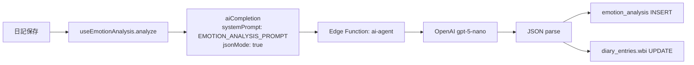

# 感情分析

> 最終更新: 2026-04-05 | ソースコード: `src/hooks/useEmotionAnalysis.ts`

## 概要

日記エントリのテキストをLLMに渡し、Plutchik 8感情・Russell感情空間・PERMA+V指標・WBIスコアを数値化して保存する機能。日記保存時に自動実行される。

## アーキテクチャ図



## 入力データ

| データソース | テーブル/API | 取得件数 | 用途 |
|---|---|---|---|
| 日記本文 | `diary_entries.body` | 1件 (保存直後のエントリ) | 感情分析対象テキスト |

## 処理フロー

### Step 1: データ収集

日記保存時に、保存したエントリの `id` と `body` がそのまま `analyze(diaryEntryId, content)` に渡される。追加のDB問い合わせは発生しない。

### Step 2: プロンプト構築

**システムプロンプト** (`EMOTION_ANALYSIS_PROMPT`) の全文:

```
あなたは感情分析の専門家です。日記のテキストを分析し、以下のJSON形式で返してください:
{
  "plutchik": { "joy": 0, "trust": 0, "fear": 0, "surprise": 0, "sadness": 0, "disgust": 0, "anger": 0, "anticipation": 0 },
  "russell": { "valence": 0.0, "arousal": 0.0 },
  "perma_v": { "p": 0, "e": 0, "r": 0, "m": 0, "a": 0, "v": 0 },
  "wbi": 0,
  "summary": "感情の要約（1文）"
}
Plutchikの各値は0-100の整数。混合感情も検出してください。強い感情は80以上、弱い感情は20以下。
russellのvalenceは-1.0〜1.0（ネガティブ〜ポジティブ）、arousalは-1.0〜1.0（低覚醒〜高覚醒）。
PERMA+Vは0-10の実数: P=ポジティブ感情, E=没頭, R=人間関係, M=意味, A=達成, V=活力。
WBIはPERMA+Vの加重平均（0-10）。
JSON以外は返さないでください。
```

**ユーザーメッセージ**: `diary_entries.body` の生テキストがそのまま渡される。

### Step 3: LLM呼び出し

| パラメータ | 値 |
|-----------|-----|
| Edge Function | `ai-agent` |
| mode | `completion` |
| model | `gpt-5-nano` (デフォルト) |
| temperature | `0.3` |
| maxTokens | `1000` (デフォルト) |
| response_format | `{ type: "json_object" }` (jsonMode: true) |

### Step 4: 結果保存

**emotion_analysis テーブルへの INSERT:**

| カラム | 値の出所 |
|--------|---------|
| `diary_entry_id` | 引数の `diaryEntryId` |
| `joy` | `result.plutchik.joy` (0-100) |
| `trust` | `result.plutchik.trust` (0-100) |
| `fear` | `result.plutchik.fear` (0-100) |
| `surprise` | `result.plutchik.surprise` (0-100) |
| `sadness` | `result.plutchik.sadness` (0-100) |
| `disgust` | `result.plutchik.disgust` (0-100) |
| `anger` | `result.plutchik.anger` (0-100) |
| `anticipation` | `result.plutchik.anticipation` (0-100) |
| `valence` | `result.russell.valence` (-1.0 ~ 1.0) |
| `arousal` | `result.russell.arousal` (-1.0 ~ 1.0) |
| `perma_p` | `result.perma_v.p` (0-10) |
| `perma_e` | `result.perma_v.e` (0-10) |
| `perma_r` | `result.perma_v.r` (0-10) |
| `perma_m` | `result.perma_v.m` (0-10) |
| `perma_a` | `result.perma_v.a` (0-10) |
| `perma_v` | `result.perma_v.v` (0-10) |
| `wbi_score` | `result.wbi` (0-10) |
| `model_used` | `"gpt-5-nano"` (ハードコード) |

**diary_entries テーブルの UPDATE:**

| カラム | 値 |
|--------|-----|
| `wbi` | `result.wbi` (0-10) |
| 条件 | `id = diaryEntryId` |

## 中間出力の保存

キャッシュや差分分析のロジックはない。日記が保存されるたびに毎回新規分析を実行し、`emotion_analysis` に新しい行を INSERT する。同一日記エントリに対する重複分析の防止機構はフック側にはない。

## 出力例

```json
{
  "plutchik": {
    "joy": 65,
    "trust": 45,
    "fear": 10,
    "surprise": 30,
    "sadness": 15,
    "disgust": 5,
    "anger": 8,
    "anticipation": 55
  },
  "russell": {
    "valence": 0.6,
    "arousal": 0.3
  },
  "perma_v": {
    "p": 7.2,
    "e": 6.0,
    "r": 5.5,
    "m": 6.8,
    "a": 7.0,
    "v": 6.5
  },
  "wbi": 6.5,
  "summary": "穏やかな達成感と明日への期待が共存した1日"
}
```

## UI表示

**Today ページ** (`src/pages/Today.tsx`):

- 日記保存後、Plutchik 8感情のうち値が 20 を超える上位2つが「感情バッジ」として日記エントリの横に表示される
- バッジは色付き (各感情に固定色が割り当て) で、感情名と数値を表示
- 感情バッジの定義は `PLUTCHIK_LABELS` 定数にマップされている

```
Joy (#FFD700), Trust (#98FB98), Fear (#228B22), Surprise (#00CED1),
Sadness (#4169E1), Disgust (#9370DB), Anger (#FF4500), Anticipation (#FFA500)
```

## ソースコード参照

| ファイル | 関数/コンポーネント | 役割 |
|---|---|---|
| `src/hooks/useEmotionAnalysis.ts` | `useEmotionAnalysis` | 分析実行フック |
| `src/hooks/useEmotionAnalysis.ts` | `EMOTION_ANALYSIS_PROMPT` | システムプロンプト定数 |
| `src/lib/edgeAi.ts` | `aiCompletion` | Edge Function 呼び出し |
| `src/pages/Today.tsx` | `saveEntry` | 日記保存 → analyze → detect の呼び出し元 |
| `src/pages/Today.tsx` | `PLUTCHIK_LABELS` | 感情バッジの色・ラベル定義 |
| `src/pages/Today.tsx` | `EmotionBadge` | 感情バッジの型定義 |
