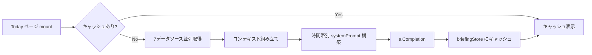

# 朝の一言 (AI Partner Briefing)

> 最終更新: 2026-04-05 | ソースコード: `src/hooks/useMorningBriefing.ts`

## 概要

Todayページを開いた時に、ユーザーの日記・感情データ・タスク・夢・行動パターンなど多数のコンテキストを集約し、時間帯に応じた短い一言メッセージをLLMが生成する機能。Zustand ストアで24時間 (日付+時間帯単位) キャッシュされる。

## アーキテクチャ図



## 入力データ

| データソース | テーブル/API | 取得件数 | 用途 |
|---|---|---|---|
| 日記 | `diary_entries` (body, wbi, created_at) | 直近5件 | 最近の日記内容 + WBI推移 |
| 感情分析 | `emotion_analysis` (8感情 + valence + arousal + wbi_score) | 直近10件 | 感情傾向・主要感情 |
| タスク | `tasks` (title, status, due_date, completed_at) | 直近10件 (open/done) | 今日の完了/期限タスク |
| 夢 | `dreams` (title, status) | active/in_progress 5件 | 進行中の夢リスト |
| CEO洞察 | `ceo_insights` (insight, category) | 直近5件 (preference/tendency/work_rhythm/pattern) | ユーザーの特徴 |
| 作業リズム | `prompt_log` (created_at) | 直近50件 | 深夜作業率の算出 |
| 連続記録 | `calculateStreak()` | 1値 | 日記連続記録日数 |
| カレンダー | (引数として渡される) | - | 今日/明日の予定テキスト |

上記7ソースは **`Promise.all` で並列取得** される。

## 処理フロー

### Step 1: キャッシュ判定

キャッシュキー: `{YYYY-MM-DD}_{timeMode}` (例: `2026-04-05_morning`)

`useBriefingStore` (Zustand) の `lastFetched` がキャッシュキーと一致し、`message` が `null` でない場合はLLM呼び出しをスキップしてキャッシュを返す。

キャッシュ無効化: `invalidate()` を呼ぶと `lastFetched = null, message = null` にリセットされる。日記保存時に `invalidateBriefing()` が呼ばれ、新しい日記コンテキストで再生成される。

### Step 2: コンテキスト組み立て

以下のデータをテキストブロックに変換し、存在するもののみ配列に追加:

1. **感情傾向**: 直近N件の8感情平均から主要感情を特定、WBI平均を算出
   - 例: `直近の感情傾向(10件): 主要感情=joy(65), WBI平均=6.8`
2. **WBI推移**: 直近日記のWBIと過去平均の差分
   - 例: `WBI推移: 最新7.2 / 過去平均6.0 (+1.2)`
3. **直近の日記**: 3件、各100文字まで
4. **今日の予定**: 引数 `todayEventsText` (カレンダーから組み立て済み)
5. **明日の予定**: 引数 `tomorrowEventsText`
6. **今日完了したタスク**: `status='done'` かつ `completed_at` が今日
7. **期限が今日のタスク**: `status='open'` かつ `due_date` が今日
8. **未完了タスク**: `status='open'` の先頭3件
9. **深夜作業率**: 直近50件の prompt_log のうち22時-6時の割合が20%超の場合のみ表示
10. **社長の特徴**: `ceo_insights` の `[category] insight` 形式
11. **進行中の夢**: `title (status)` 形式
12. **連続記録**: N日

### Step 3: プロンプト構築

**システムプロンプト** のキーポイント:

```
あなたはユーザーの人生パートナーAI。一番の理解者。

## 最重要: 短く。最大2-3文、100字以内。長い文章は絶対NG。

## 口調
- 丁寧だが堅すぎない（です・ます調）
- 温かく、感情に寄り添う

## 絶対にやらないこと
- 長文（3文以上）
- 実行できない約束
- 業務報告の羅列
- 汎用的な言葉（「頑張りましょう」「無理せず」）

## 最重要ルール
この人固有の文脈に1つだけ触れる。全部に触れない。一番響くことを1つ選ぶ。
```

**時間帯別指示:**

| TimeMode | 指示 | 文字数 |
|----------|------|--------|
| `morning` | 今日の心構えを1-2文 | 80字以内 |
| `afternoon` | 午前への承認を1文 | 50字以内 |
| `evening` | 今日への共感と労い+明日への軽い触れ | 100字以内 |

**ユーザーメッセージ**: Step 2 で組み立てたコンテキストブロック全体。データが一切ない場合は `（特にデータなし。穏やかな一言を）`。

### Step 4: LLM呼び出し

| パラメータ | 値 |
|-----------|-----|
| Edge Function | `ai-agent` |
| mode | `completion` |
| model | `gpt-5-nano` (デフォルト) |
| temperature | `0.3` (デフォルト) |
| maxTokens | `200` |
| jsonMode | `false` (テキスト応答) |

### Step 5: 結果保存

DBへの保存はない。結果は `useBriefingStore` (Zustand) に格納される:

| プロパティ | 値 |
|-----------|-----|
| `message` | LLM応答テキスト (trim済み) |
| `lastFetched` | キャッシュキー (`{date}_{timeMode}`) |

LLM応答が空の場合やエラー発生時は **フォールバックメッセージ** が表示されるが、キャッシュはされない (次回レンダリングでリトライ):

| TimeMode | フォールバック |
|----------|---------------|
| `morning` | `今日も穏やかに始めましょう。` |
| `afternoon` | `午後もあなたのペースで。` |
| `evening` | `今日も一日、おつかれさまでした。` |

## 中間出力の保存

DBには保存しない。Zustand ストアのインメモリキャッシュのみ。ページリロードでキャッシュは消失し、再生成される。

日記保存時に `invalidateBriefing()` が呼ばれると、キャッシュが無効化され、新しいコンテキスト (保存された日記を含む) で再生成が走る。

## 出力例

```
今日はMTGが3件。午前中に集中作業の時間を確保するといいかもしれません。
```

```
午前中に1件完了できましたね。午後もこのペースで。
```

```
夜遅くまで続いていますね。今日はMTG3件こなして充分です。明日午前フリーなので少しゆっくりでも。
```

## UI表示

**Today ページ** (`src/pages/Today.tsx`):

- ページ上部のアクセントカラー背景カードに「AI Partner」ラベル付きで表示
- ロード中はスピナーと「考え中...」テキスト
- LLM応答がない場合のデフォルト: `今日も穏やかに過ごせますように。`

## 関連ファイル: aiPartner.ts

`src/lib/aiPartner.ts` はAIパートナーの汎用ペルソナ定義とプロンプトビルダーを提供する。`useMorningBriefing` は独自のシステムプロンプトを使用しているが、以下の共通ペルソナ設計思想を踏襲している:

- **役割**: ユーザーを一番理解している存在、良い未来へ導く
- **口調**: 丁寧だが堅すぎない、温かい、提案する
- **禁止事項**: 他者比較、罪悪感を与える表現、事務的な報告口調

`buildPartnerSystemPrompt(context)` 関数は、感情・日記・夢・タスク・連続記録・時間帯の文脈を注入したシステムプロンプトを構築する。将来的にチャット機能等で使用可能。

## ソースコード参照

| ファイル | 関数/コンポーネント | 役割 |
|---|---|---|
| `src/hooks/useMorningBriefing.ts` | `useMorningBriefing` | ブリーフィング生成フック |
| `src/hooks/useMorningBriefing.ts` | `getFallback` | 時間帯別フォールバックメッセージ |
| `src/lib/edgeAi.ts` | `aiCompletion` | Edge Function 呼び出し |
| `src/lib/aiPartner.ts` | `buildPartnerSystemPrompt` | 汎用ペルソナプロンプトビルダー |
| `src/lib/aiPartner.ts` | `getTimeOfDay` | 時間帯判定 |
| `src/lib/timeMode.ts` | `TimeMode` | 時間帯型定義 (morning/afternoon/evening) |
| `src/lib/streak.ts` | `calculateStreak` | 連続記録日数計算 |
| `src/stores/briefing.ts` | `useBriefingStore` | Zustand キャッシュストア |
| `src/pages/Today.tsx` | `Briefing` (JSX変数) | UI表示部分 |
