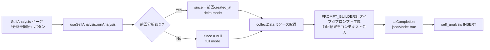

# 自己分析 (MBTI / Big5 / ストレングスファインダー / 感情トリガー / 価値観)

> 最終更新: 2026-04-05 | ソースコード: `src/hooks/useSelfAnalysis.ts`

## 概要

蓄積された日記・プロンプトログ・タスク・カレンダー・夢リストの5データソースを統合し、MBTI・Big5・ストレングスファインダー・感情トリガー・価値観の5種類のパーソナリティ分析をLLMで実行する機能。差分分析モードにより、前回分析以降の新規データのみを対象に、前回結果をコンテキストとして含めた「変化追跡」が可能。

## アーキテクチャ図



## 入力データ

| データソース | テーブル/API | 取得件数 | 用途 |
|---|---|---|---|
| 日記 | `diary_entries` (body, entry_date, created_at) | 最大80件 | 性格推定の主要データ |
| プロンプトログ | `prompt_log` (prompt, tags, created_at) | 最大200件 | 行動パターン分析 (コミュニケーションスタイル、活動時間帯) |
| タスク | `tasks` (title, status, created_at, completed_at) | 最大100件 | 実行力・先延ばし傾向の分析 |
| カレンダー | `calendar_events` (title, start_time, end_time, is_all_day) | 最大50件 | 時間管理パターンの分析 |
| 夢/目標 | `dreams` (title, description, category, status) | 全件 | 価値観・志向性の分析 |

## 処理フロー

### Step 1: 前回分析の取得

```sql
SELECT * FROM self_analysis
WHERE analysis_type = '{type}'
ORDER BY created_at DESC
LIMIT 1
```

前回結果がある場合: `since = prevAnalysis.created_at` (差分モード)
前回結果がない場合: `since = null` (全件モード)

### Step 2: データ収集 (`collectData`)

全5ソースを順次取得する。`since` が指定されている場合、`diary_entries` と `prompt_log` は `created_at > since` でフィルタされる。`tasks`, `calendar_events`, `dreams` は常に最新データを取得する。

プロンプトログからは以下の行動データを抽出:
- **タグ出現頻度**: 上位15タグを `タグ名: N回` 形式で集約
- **活動ピーク時間帯**: UTC基準で上位5時間帯を `H時: N回` 形式で集約
- **指示サンプル**: 直近30件のプロンプトを `[datetime] プロンプト先頭150文字` で列挙

組み立てられるユーザーメッセージの構造:

```
## 日記 (N件)
[date] body...

## 行動分析: プロンプトログ (N件)
よく使うタグ: tag1: 5回, tag2: 3回, ...
活動ピーク時間帯(UTC): 14時: 20回, 10時: 15回, ...

### 指示サンプル（コミュニケーションスタイル分析用）
[datetime] prompt...

## タスク管理 (完了N件 / 未完了N件)
- [status] title (完了: date)

## スケジュール (N件)
- datetime title

## 夢・目標
- [status][category] title
```

### Step 3: プロンプト構築

5種類の分析タイプごとにプロンプトビルダー関数がある。各関数は `prev` (前回結果) を受け取り、初回と差分の2パターンのプロンプトを生成する。

| 分析タイプ | ビルダー関数 | 出力JSONの主要フィールド |
|-----------|-------------|------------------------|
| `mbti` | `mbtiPrompt(prev)` | type, type_name, confidence, dimensions (E_I/S_N/T_F/J_P), evidence, description, changes_from_previous |
| `big5` | `big5Prompt(prev)` | openness, conscientiousness, extraversion, agreeableness, neuroticism, summary, evidence, changes_from_previous |
| `strengths_finder` | `strengthsFinderPrompt(prev)` | top_strengths[5], domain_summary (4ドメイン), work_fit, growth_areas, summary, changes_from_previous |
| `emotion_triggers` | `emotionTriggersPrompt(prev)` | positive_triggers, negative_triggers, patterns, summary, changes_from_previous |
| `values` | `valuesPrompt(prev)` | values[5-7] (name, rank, score, evidence), changes, summary, changes_from_previous |

**差分分析時のプロンプト追加部分 (例: MBTI):**

```
【前回の分析結果】
前回のタイプ: INFP (仲介者)
前回のスコア: E_I=35, S_N=30, T_F=55, J_P=50

新しい日記データから、前回からの変化があれば changes_from_previous に記載してください。
タイプが変わった場合はその理由も。変化がなければ「大きな変化なし」と記載。
```

**MBTI プロンプトの特記事項:**
- S/N判定に関する注意書きが含まれている（日記は自然にS的記述が多くなるため、「思考パターン」で判定するよう指示）
- 16personalities の日本語名称マッピングが全16タイプ分含まれている
- description は500字以上を要求（核心的特徴、行動パターン、活かし方3つ、注意点3つ）
- evidence は日付付き引用を5つ以上要求

### Step 4: LLM呼び出し

| パラメータ | 値 |
|-----------|-----|
| Edge Function | `ai-agent` |
| mode | `completion` |
| model | `gpt-5-nano` (デフォルト) |
| temperature | `0.4` |
| maxTokens | `3000` |
| response_format | `{ type: "json_object" }` (jsonMode: true) |

### Step 5: 結果保存

**self_analysis テーブルへの INSERT:**

| カラム | 値の出所 |
|--------|---------|
| `analysis_type` | `'mbti'` / `'big5'` / `'strengths_finder'` / `'emotion_triggers'` / `'values'` |
| `result` | LLM応答のJSON全体 (jsonb型) |
| `summary` | `result.summary` または `result.description` |
| `data_count` | `diary件数 + prompt_log件数` |
| `model_used` | `"gpt-5-nano"` (ハードコード) |

## 中間出力の保存

- **前回結果のコンテキスト注入**: `self_analysis` テーブルの最新レコードが次回分析のプロンプトに含まれる。これによりLLMは「前回からの変化」を記述できる。
- **差分データ取得**: `since` パラメータ (= 前回分析の `created_at`) 以降のデータのみ取得するため、分析対象は常に「前回以降の新規データ」となる。ただし `tasks`, `calendar_events`, `dreams` は常に最新を取得する。
- **初回と2回目以降の違い**:
  - 初回: 全データ取得、プロンプトに前回結果なし
  - 2回目以降: 新規データのみ取得、プロンプトに前回結果を注入、`changes_from_previous` フィールドが追加

## 一括実行

SelfAnalysis ページの「分析を開始」ボタンは `ALL_TYPES = ['mbti', 'big5', 'strengths_finder', 'values']` を **順次実行** する (`emotion_triggers` は一括実行対象外)。各タイプの完了を待ってから次のタイプを実行する。

## 出力例 (MBTI)

```json
{
  "type": "INFP",
  "type_name": "仲介者",
  "confidence": "high",
  "dimensions": {
    "E_I": { "score": 35, "label": "I寄り" },
    "S_N": { "score": 30, "label": "N寄り" },
    "T_F": { "score": 55, "label": "F寄り" },
    "J_P": { "score": 50, "label": "P寄り" }
  },
  "evidence": [
    "[2026-03-01] 一人でカフェに行って本を読む時間が最も充実していた",
    "[2026-03-05] なぜこの仕事をしているのか、意味を考え込んでしまった"
  ],
  "description": "INFPは理想主義的で内省的な性格タイプです...(500字以上)",
  "changes_from_previous": "前回INFJだったが、J/Pの境界が曖昧で..."
}
```

## UI表示

**Self-Analysis ページ** (`src/pages/SelfAnalysis.tsx`):

- 各分析タイプごとにカードを表示 (MBTI, Big5, StrengthsFinder, Values)
- タイプ別の専用レンダラーコンポーネント:
  - `MbtiResult`: タイプ名 (大文字) + 日本語名 + 確信度 + 4次元バーチャート + description
  - `Big5Result`: 5因子の横棒グラフ (0-100) + summary
  - `StrengthsFinderResult`: Top5資質リスト + 4ドメインスコア + 適合する仕事 + 成長領域
  - `ValuesResult`: ランク付き価値観リスト + スコアバー + evidence
- `ChangesFromPrevious` コンポーネント: 差分分析結果がある場合にアクセントカラーのバッジで表示
- 日記20件未満の場合はボタンが無効化される

## ソースコード参照

| ファイル | 関数/コンポーネント | 役割 |
|---|---|---|
| `src/hooks/useSelfAnalysis.ts` | `useSelfAnalysis` | 分析実行フック |
| `src/hooks/useSelfAnalysis.ts` | `collectData` | 5ソース統合データ収集 |
| `src/hooks/useSelfAnalysis.ts` | `getPreviousAnalysis` | 前回分析結果の取得 |
| `src/hooks/useSelfAnalysis.ts` | `mbtiPrompt` / `big5Prompt` / `strengthsFinderPrompt` / `emotionTriggersPrompt` / `valuesPrompt` | タイプ別プロンプトビルダー |
| `src/lib/edgeAi.ts` | `aiCompletion` | Edge Function 呼び出し |
| `src/pages/SelfAnalysis.tsx` | `SelfAnalysis` | メインページコンポーネント |
| `src/pages/SelfAnalysis.tsx` | `MbtiResult` / `Big5Result` / `StrengthsFinderResult` / `ValuesResult` | タイプ別結果レンダラー |
| `src/pages/SelfAnalysis.tsx` | `ChangesFromPrevious` | 差分変化表示コンポーネント |
| `src/pages/SelfAnalysis.tsx` | `AnalysisResultView` | タイプ判定→レンダラー振り分け |
