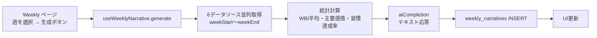

# 週次ナラティブ

> 最終更新: 2026-04-05 | ソースコード: `src/hooks/useWeeklyNarrative.ts`

## 概要

1週間分の日記・感情データ・完了タスク・ゴール進捗・習慣ログを集約し、LLMがユーザーの週を温かく振り返る200-300字のナラティブ (物語的な振り返り文) を生成する機能。結果は `weekly_narratives` テーブルに永続保存され、過去6週分の一覧表示と個別生成が可能。

## アーキテクチャ図



## 入力データ

| データソース | テーブル/API | 取得件数 | 用途 |
|---|---|---|---|
| 日記 | `diary_entries` (body, created_at) | 指定週の全件 | 週の出来事テキスト |
| 感情分析 | `emotion_analysis` (8感情 + wbi_score) | 指定週の全件 | WBI平均・主要感情の算出 |
| 完了タスク | `tasks` (title, status, completed_at) | 指定週に completed_at がある全件 | 達成リスト |
| ゴール | `goals` (title, progress, status) | 直近10件 | ゴール進捗状況 |
| 習慣 | `habits` (id, title, icon) | active な全件 | 習慣達成率の分母 |
| 習慣ログ | `habit_logs` (habit_id, completed_at) | 指定週の全件 | 習慣達成率の分子 |

上記6ソースは **`Promise.all` で並列取得** される。

## 処理フロー

### Step 1: 週リストの構築

ページロード時に過去6週分の `weekStart` (月曜) と `weekEnd` (日曜) を算出し、既存の `weekly_narratives` レコードと照合する。

```sql
SELECT * FROM weekly_narratives
WHERE week_start IN ('{week1}', '{week2}', ..., '{week6}')
ORDER BY week_start DESC
```

### Step 2: データ収集 (generate 呼び出し時)

指定された `weekStart` ～ `weekEnd` の範囲で6テーブルを並列クエリ:

- `diary_entries`: `created_at >= {weekStart}T00:00:00 AND created_at <= {weekEnd}T23:59:59`
- `emotion_analysis`: 同上
- `tasks`: `completed_at` が期間内
- `goals`: 全件 (直近10件)
- `habits`: `active = true` の全件
- `habit_logs`: `completed_at` が期間内

### Step 3: 統計計算

以下の統計値を算出:

| 統計 | 計算方法 |
|------|---------|
| `diary_count` | 期間内日記件数 |
| `task_count` | 期間内完了タスク件数 |
| `avg_wbi` | 期間内 `emotion_analysis.wbi_score` の平均 (小数1桁) |
| `dominant_emotion` | Plutchik 8感情の合計が最大のもの |
| `habitRate` | `habit_logs件数 / (active_habits数 x 7)` のパーセンテージ |

### Step 4: プロンプト構築

**ユーザーメッセージ** の構造:

```
## 期間: 2026-03-31 - 2026-04-06

## 日記 (5件)
[2026-03-31] 今日は新しいプロジェクトの...
[2026-04-01] MTGで提案が通った...
...

## 完了タスク (8件)
- ユーザー調査レポート作成
- デザインレビュー対応
...

## ゴール進捗
- 英語力向上 (40%, in_progress)
- 体力づくり (60%, active)
...

## 習慣 (達成率: 71%)
- [icon] 朝散歩: 5/7日
- [icon] 読書: 4/7日
...

## 感情データ
WBI平均: 6.8
優勢感情: joy
```

**システムプロンプト:**

```
以下のデータから、ユーザーの1週間を温かく振り返るナラティブを200-300字で書いてください。
- 達成したことを具体的に褒める
- 感情の変化に触れる
- 来週への穏やかな提案を1つ添える
- 他者比較は絶対にしない
- 「〜でした」「〜ですね」の丁寧な口調
テキストのみ返してください。JSONではなく純粋なテキストです。
```

### Step 5: LLM呼び出し

| パラメータ | 値 |
|-----------|-----|
| Edge Function | `ai-agent` |
| mode | `completion` |
| model | `gpt-5-nano` (デフォルト) |
| temperature | `0.7` |
| maxTokens | `600` |
| jsonMode | `false` (テキスト応答) |

temperature が他の機能 (0.3-0.4) より高め (0.7) に設定されている。ナラティブの表現に多様性を持たせるため。

### Step 6: 結果保存

**weekly_narratives テーブルへの INSERT:**

| カラム | 値の出所 |
|--------|---------|
| `week_start` | 引数の `weekStart` (YYYY-MM-DD) |
| `week_end` | 引数の `weekEnd` (YYYY-MM-DD) |
| `narrative` | LLM応答テキスト |
| `stats` | `{ diary_count, task_count, avg_wbi, dominant_emotion }` (jsonb型) |

## 中間出力の保存

- 生成済みのナラティブは `weekly_narratives` テーブルに永続保存される
- ページロード時に過去6週分の既存ナラティブを一括取得し、未生成の週のみ「生成」ボタンを表示する
- 同一週に対する再生成の制御はフック側にはない (UIで制御)

## 出力例

```
今週は5件の日記と8件のタスク完了、充実した1週間でしたね。特にユーザー調査レポートの完成は大きな達成です。joyが主要感情で、WBIも6.8と安定していました。朝散歩の習慣も5/7日と高い達成率です。来週は読書の時間を少し増やしてみると、さらにリフレッシュできるかもしれません。
```

## UI表示

**Weekly ページ** (具体的なページコンポーネントはフックの呼び出し元に依存):

- 過去6週分を時系列で一覧表示
- 各週に `weekNumber`、ラベル (今週/先週/N週前)、ナラティブ有無を表示
- 未生成の週は「生成」ボタンを表示
- 生成中はスピナー表示 (`generating` フラグ)

## ソースコード参照

| ファイル | 関数/コンポーネント | 役割 |
|---|---|---|
| `src/hooks/useWeeklyNarrative.ts` | `useWeeklyNarrative` | 週次ナラティブフック |
| `src/hooks/useWeeklyNarrative.ts` | `WeeklyNarrativeRecord` | ナラティブレコード型 |
| `src/hooks/useWeeklyNarrative.ts` | `WeekInfo` | 週情報型 (ラベル + ナラティブ有無) |
| `src/hooks/useWeeklyNarrative.ts` | `getMonday` / `formatDate` / `getWeekNumber` | 週計算ユーティリティ |
| `src/lib/edgeAi.ts` | `aiCompletion` | Edge Function 呼び出し |
