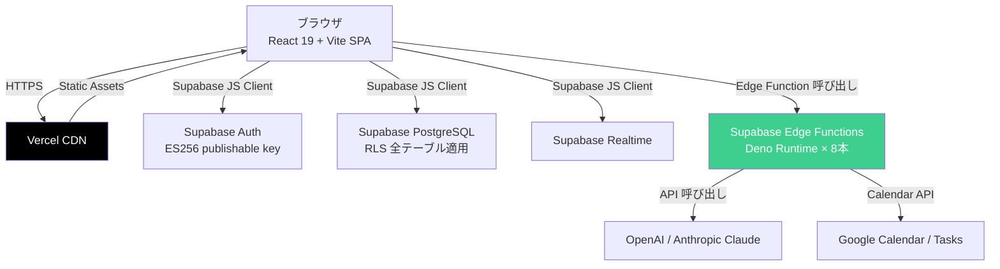

# focus-you インフラ・セキュリティ意思決定レポート v2

**対象プロダクト**: focus-you（個人向けジャーナリング/感情ダッシュボード SaaS）
**作成日**: 2026-04-17
**読者**: 社長（意思決定者本人）
**ステータス**: review（社長レビュー待ち）
**置き換え対象**: `focus-you-infrastructure-decision-2026-04-17.md`（v1、学習軸混入のため廃止）

---

## 0. エグゼクティブサマリ（30秒で読める）

### インフラ結論: Vercel + Supabase 継続、移行不要

React + Vite SPA は Vercel CDN で動いている。Supabase Edge Functions（Deno runtime 8本）は Vercel と分離されており、今すぐ移行する理由はない。**動いているものを壊すコストが便益を上回る。**

### セキュリティ結論: 業界標準ライン到達済み、リリース前必須は10項目で80-120h

Supabase AES-256 + TLS 1.3 + RLS 全テーブル適用は、競合（Reflectly, Reflection.app, Stoic, Daylio）と同等かそれ以上。E2EE は採用しない（後述）。リリース前の未対応ギャップは実装で埋められる範囲。

### E2EE: 不採用（AI機能と矛盾するため、合理的判断）

focus-you の価値中核はサーバ側 AI 処理（感情分析・narrator・チャット）。E2EE を採用すると AI 機能が動かなくなる。Day One ですら E2EE 有効時に検索・一部機能が無効化される。**不採用は後退ではなく、プロダクト設計との整合性を取った判断。**

### 月額コスト

| フェーズ | 月額目安 |
|---------|---------|
| 現状（個人利用） | $20（Vercel Pro）+ Supabase Free/Pro |
| 商用化後・数百 MAU | $45（Vercel Pro $20 + Supabase Pro $25） |
| バズ時（5TB帯域） | Vercel 単独だと $620 のリスクあり（詳細は Section 2） |

### 次の3アクション

1. **今すぐ**: Section 8 の6つの問いに答える（判断の基点を決める）
2. **リリース前**: Section 4 の必須10項目を順次対応（80-120h）
3. **リリース後3ヶ月**: Section 5 の推奨項目を継続対応

---

## 1. focus-you の現状

### スタック構成



**何を動かしているか**:
- フロントエンド: React 19 + Vite SPA → Vercel CDN で配信
- バックエンド: Supabase 8本の Edge Functions（Deno runtime）
  - `ai-agent`, `google-calendar-proxy`, `news-collect/enrich/learn`, `diary-embed/rhythm`, `narrator-update`
- 認証: Supabase Auth + GitHub OAuth（ES256 publishable key 方式、2026年対応済み）
- DB: Supabase PostgreSQL + pgvector（RLS 全テーブル適用済み）

**扱っているデータ**:

| データ種別 | 機微度 | 保存先 |
|-----------|-------|-------|
| 日記本文 | 最高（個人の内面・人間関係） | Supabase DB |
| 感情分析結果 | 高（メンタルヘルス情報相当） | Supabase DB |
| AI チャット履歴 | 高 | Supabase DB |
| Google Calendar | 中（予定・人間関係） | API 連携、refresh token は AES-256-GCM 個別暗号化済 |

### セキュリティ現状一覧

| 領域 | 現状実装 | 評価 |
|------|---------|------|
| at rest 暗号化 | Supabase AES-256 自動 | 完了 |
| in transit 暗号化 | Vercel/Supabase 自動 TLS 1.3 | 完了 |
| Supabase RLS | 全テーブル適用、anon キー全権限削除済 | 完了 |
| Edge Function 認証 | verify_jwt=false + 関数内 getUser() | 完了 |
| Google refresh token 暗号化 | AES-256-GCM 個別暗号化 | 完了 |
| GitHub OAuth | Supabase Auth 連携済 | 完了 |
| **パスワード強度** | デフォルト最小6文字（弱い） | 要対応 |
| **MFA** | 機能はあるが有効化確認必要 | 要対応 |
| **アカウント削除フロー** | 不明（連鎖削除の確認必要） | 要対応 |
| **データエクスポート** | 未実装 | 要対応 |
| **セキュリティヘッダ** | 基本ヘッダのみ、CSP 未設定 | 要対応 |
| **プライバシーポリシー** | 未作成 | 要対応（法的必須） |
| **利用規約** | 未作成 | 要対応（法的必須） |
| **漏洩時通知体制** | 未文書化 | 要対応 |
| **RLS マルチテナントテスト** | 未整備 | 要対応 |

---

## 2. インフラ判断: Vercel + Supabase 継続

### なぜ Vercel を継続するのか

| 理由 | 説明 |
|------|------|
| Deno EF 互換性 | Edge Functions 8本が Deno runtime。AWS Lambda / Azure Functions に移行するには全書換が必要（推定 16-64h）。移行コストが便益を上回る |
| 移行リスク | Supabase Auth callback URL 変更、環境変数の再設定、Realtime 再設定など、移行中の本番停止リスクがある |
| 現状動いている | Supabase が CDN 役の Vercel と分離して独立しており、スタックは安定している |
| コスト感 | Pro $20/月 は個人開発フェーズとして妥当 |

### なぜ Cloudflare/AWS/Azure に移さないのか

- **Cloudflare**: 帯域コスト（egress $0）と WAF は魅力的だが、Deno EF を移行する必要はない。Supabase が Edge Functions を担っているため、Vercel はただの静的ホスト役
- **AWS/Azure**: Deno runtime の書換コストが現実的でない。Supabase Realtime（WebSocket）の再構築も必要

### バズ時のコストリスク（把握しておく）

| シナリオ | Vercel Pro 単独 | 対策 |
|---------|----------------|------|
| 5TB 帯域（バズ） | 約 $620（4TB 超過 × $0.15/GB） | 商用化フェーズで Cloudflare Pages への並走を検討 |
| 1,000 MAU（通常） | $20〜$96（Build Turbo 含む） | 許容範囲 |

**商用化フェーズで再検討する余地はある**。ただし今すぐ移行する理由はない。バズ時の保険として Cloudflare Pages を staging に並走させる（$5/月）という選択肢は将来の検討事項。

### 月額コスト

| 構成 | 月額 |
|------|------|
| Vercel Pro | $20 |
| Supabase Pro | $25 |
| 合計 | **$45** |

---

## 3. 商用版セキュリティ要件

### 現状評価: 業界標準ライン到達済み

「個人向けジャーナリング SaaS のセキュリティ最低ライン」は以下:

1. at rest 暗号化（AES-256）: 全社必須
2. TLS 1.2+: 全社必須
3. パスコード/生体ロック（アプリ側）: ほぼ全社あり
4. GDPR データ削除/エクスポート対応: 主要各社対応
5. E2EE: オプション/差別化要素（全社必須ではない）
6. MFA: 未対応が多い（OAuth/Apple Sign In に頼る形が主流）

focus-you の現状（at rest AES-256 + TLS 1.3 + Supabase RLS）はすでに Reflectly, Reflection.app, Stoic, Daylio と同等水準。

### 競合比較表

| アプリ | at rest | TLS | E2EE | データ削除 | データエクスポート | MFA |
|--------|---------|-----|------|-----------|-----------------|-----|
| Day One | AES-256 | 1.3 | AES-GCM-256（デフォルト） | 5日リカバリ後 | JSON/PDF/MD | 要確認 |
| Journey | あり | あり | asymmetric E2EE（Cloud Sync のみ） | あり | JSON/DOCX | 要確認 |
| Reflection.app | あり | あり | なし | GDPR 準拠と明記 | あり | 要確認 |
| Reflectly | あり | あり | なし | GDPR 準拠と明記 | あり | なし |
| Stoic / How We Feel | あり | あり | なし | 要確認 | 要確認 | なし |
| Daylio | あり | あり | なし | あり | JSON/CSV | なし |
| **focus-you（現状）** | **AES-256** | **1.3** | **なし（不採用）** | **要実装** | **要実装** | **要有効化** |

### E2EE 採用 vs 不採用の判断（不採用推奨）

**E2EE を採用すると何が起きるか**:

| 機能 | E2EE 採用時 | E2EE 不採用（現状） |
|------|------------|------------------|
| 感情分析 | サーバ側 LLM 動かない | フル活用可能 |
| narrator | 動かない（サーバ側 AI 処理前提） | フル活用可能 |
| AI チャット | 動かない | フル活用可能 |
| 検索機能 | 暗号化検索は複雑か無効化 | 標準 PostgreSQL 検索 |
| 実装コスト | +40-80h + 継続メンテナンス | 0h |
| データ復旧 | キー紛失で完全消失 | バックアップから復旧可 |

Day One ですら E2EE 有効化中は「Discover（共有）」が無効化され、Journey は E2EE で検索が無効になる（しかも不可逆）。学術論文（arXiv:2412.20231）も「E2EE と AI モデルの組み合わせは根本的に相容れない」と指摘している。

**E2EE 不採用の対外説明方針**（プライバシーポリシー文言案）:

> focus-you では、AI による感情分析・narrator・チャット機能を提供するため、サーバ側で日記内容にアクセスできる設計としています。その代わりに以下を実施します: (1) 日記本文にアクセスする処理は `emotion_analysis` と `narrator-update` の2関数のみに限定、(2) OpenAI/Anthropic への送信は対象エントリのみ、(3) AES-256 + TLS 1.3 で全データを暗号化、(4) 漏洩時は72時間以内に通知。

**代替3原則（E2EE の代わりに約束すること）**:
1. **最小権限**: 日記本文に触れる関数を2本に限定し、それ以外は SELECT しない
2. **透明性**: プライバシーポリシーにアクセス可能な処理範囲を明記する
3. **即時対応**: 漏洩時の72時間通知体制を事前文書化する

---

## 4. リリース前必須10項目（80-120h）

| # | 項目 | 推定工数 | なぜ必須か |
|---|------|---------|-----------|
| 1 | プライバシーポリシー（改正個情法 + 外部送信規律対応） | 8-16h | 法的必須。外部送信先（OpenAI/Supabase/Google）を明記する |
| 2 | 利用規約（未成年禁止・責任範囲・AI 利用条件） | 8-16h | 法的必須。18歳以上限定を明記すると COPPA/GDPR 8条の複雑な対応を回避できる |
| 3 | Cookie 同意（外部送信規律対応 / EU 提供時は同意バナー） | 8h | 日本のみなら外部送信規律の公表ページで足りる。EU 提供時は同意バナー必須 |
| 4 | アカウント削除フロー（連鎖削除 + Storage + Vector + 30日猶予） | 16-24h | GDPR 第17条「忘れられる権利」+ 改正個情法削除権。DB だけでなく Storage/Vector も対象 |
| 5 | データエクスポート（JSON / Markdown） | 8-16h | GDPR 第20条「データポータビリティ」。「設定 > エクスポート」ボタンで ZIP 化して配信 |
| 6 | MFA 有効化（Supabase Auth TOTP オプション提供） | 4-8h | 日記という機微データを扱う最低ライン。Supabase の既存機能を有効化するだけ |
| 7 | セキュリティヘッダ（CSP, HSTS, Permissions-Policy, X-Frame-Options, Referrer-Policy） | 4-8h | XSS / Clickjacking 対策。vercel.json に追記するだけで完結 |
| 8 | パスワード強度設定（最小10文字に変更） | 1h | Supabase Dashboard 設定変更のみ。現状デフォルト6文字は弱い |
| 9 | 漏洩時通知体制の文書化（誰が・何を・72時間以内にどう連絡するか） | 4h | GDPR 必須 + 改正個情法推奨。事故が起きてから準備するのでは間に合わない |
| 10 | RLS マルチテナントテスト（User A → User B データ取得不可テスト） | 8h | ユーザー間データ漏洩が起きると致命的。Playwright 等で自動テスト化 |
| **合計** | | **69-127h** | |

---

## 5. リリース後3ヶ月以内に対応（推奨）

| # | 項目 | 工数目安 | なぜ推奨か |
|---|------|---------|-----------|
| 1 | レートリミット（Edge Function ごと、ユーザーごと） | 8-16h | DoS 対策 + OpenAI 課金の乱用防止（AI チャットに特に必要） |
| 2 | Cloudflare Turnstile（sign-up / パスワードリセットに追加） | 4-8h | Bot によるアカウント大量生成を防止。無料・無制限 |
| 3 | セッション一覧 UI + 全デバイスからログアウト | 8-16h | ユーザーの安心感向上。「いま自分のアカウントがどこからログイン中か」が見える |
| 4 | 軽量監査ログ（ログイン履歴をユーザー本人が確認できる） | 8-16h | 改正個情法対応 + 安心感 |
| 5 | 連続ログイン失敗ブロック（10回失敗で30分ブロック等） | 4-8h | ブルートフォース対策 |
| 6 | 新デバイスログイン・パスワード変更時のメール通知 | 8-16h | 不正アクセスの早期検知 |
| 7 | 依存関係脆弱性スキャン継続運用（Dependabot 設定確認） | 4h | 設定確認のみ。未設定なら有効化する |

---

## 6. 採用しない項目（過剰投資の明示）

これらは個人向けプロダクトのリリース前後フェーズでは不要。ユーザー数1万超・法人B2B 拡張時に改めて検討する。

| 項目 | 理由 |
|------|------|
| SOC 2 Type 2 | 個人向けプロダクトには過剰。取得に6-12ヶ月 + 200-500万円かかる。ユーザー1万超・法人顧客獲得後に検討 |
| ISO 27001 | 同上 |
| Bug Bounty Program | HackerOne / Bugcrowd は最低 $500/月。ユーザー1万超で検討 |
| 外部 Pentest（専門業者） | 30-100万円。OWASP Top 10 セルフチェックで現フェーズは代替可能 |
| HSM / BYOK / HYOK | 法人金融・医療向けの鍵管理要件。個人 SaaS には不要 |
| Splunk SIEM | 個人向けには過剰。Supabase ログ + Slack 通知で十分 |
| Vercel Enterprise | Pro $20/月 で足りる。Enterprise は OWASP WAF が欲しい場合に検討 |
| Supabase Enterprise | Pro $25/月 で足りる |
| Cloudflare 前段配置（WAF） | バズ時のコストリスクが顕在化したら検討。今は Vercel Firewall + Supabase で十分 |

---

## 7. 法的要件の3段階対応

公開地域に応じて段階的に対応できる。最初は A（日本のみ）を推奨。

### A. 日本のみ（MVP 推奨、追加工数 0h）

改正個人情報保護法 + 外部送信規律 + 特定電子メール法

| 必要対応 | 内容 |
|---------|------|
| プライバシーポリシー | 利用目的・安全管理措置・第三者提供（Supabase/Vercel/OpenAI = 越境移転）を明記 |
| 外部送信規律（2023年施行） | 「外部送信される情報の一覧」ページを公表（Supabase/OpenAI/Google への送信を列挙） |
| 削除請求対応 | アカウント削除フロー（Section 4 の #4 で対応） |
| 特定電子メール法 | メール配信時に送信者情報・オプトアウトリンクを記載 |

### B. + 英語圏（US/CA/AU/UK）（追加 16-24h）

A の全対応 + CCPA（カリフォルニア）対応

| 必要対応 | 内容 |
|---------|------|
| Do Not Sell オプション | カリフォルニア州居住者向けの「データ販売拒否」手段を提供 |
| 英語版プライバシーポリシー | A の日本語版を英語化（16-24h） |

※ 年間売上 $25M 以下なら CCPA の義務は軽減される。

### C. + EU 含む（追加 40-80h）

B の全対応 + GDPR Cookie 同意 + DPA + 72時間通知体制

| 必要対応 | 内容 | 工数 |
|---------|------|------|
| Cookie 同意バナー | EU 居住者向けに「事前同意なしに Cookie を置かない」実装 | 8h |
| DPA（Data Processing Agreement） | Supabase/Vercel/OpenAI との DPA 締結 | 8-16h |
| GDPR 72時間通知 | 漏洩時のデータ保護当局通知体制の文書化と演習 | 8-16h |
| GDPR Article 28 準拠 | 処理者との契約内容の整備 | 8-24h |

---

## 8. 社長判断が必要な6つの問い

これらへの回答が、リリース前の実装計画と法的対応の範囲を決める。

---

**問い1: 公開地域はどこまでか**

| 選択肢 | 追加工数 | 推奨度 |
|--------|---------|-------|
| A. 日本のみ（MVP 推奨） | 0h | 最優先 |
| B. 日本 + 英語圏 | +16-24h | 需要が見えてから |
| C. 日本 + EU 含む | +40-80h | 需要が見えてから |

---

**問い2: E2EE 採用の判断**

Section 3 で詳述した通り、**不採用推奨**。

- E2EE 採用 → 感情分析・narrator・AI チャットが動かなくなる
- E2EE 不採用 → 「最小権限 + 透明性 + 漏洩時即時対応」の3原則で代替

この判断で合っているか確認したい。

---

**問い3: 1年目のユーザー数目標**

| 規模感 | セキュリティ投資ライン |
|--------|---------------------|
| ～100 ユーザー（β） | リリース前必須のみ |
| ～1,000 ユーザー | 必須 + 推奨（レートリミット、Turnstile、監査ログ） |
| ～10,000 ユーザー | 上記 + Cloudflare 前段（WAF $25/月）、軽量 SIEM |
| 10万ユーザー超 | 外部 Pentest、Bug Bounty、SOC 2 Type 1 検討 |

---

**問い4: 未成年許可の方針**

| 選択肢 | 必要対応 |
|--------|---------|
| 18歳以上のみ（推奨） | 利用規約に明記するだけ。年齢確認は自己申告で OK |
| 13歳以上 | EU での GDPR 第8条（16歳未満は親権者同意）対応が必要。実装が複雑 |
| 13歳未満も許可 | COPPA 対応が必要。事実上不可能に近い |

**推奨: 18歳以上のみ**。学生需要を取りたいなら「16歳以上、親権者の同意推奨」程度の文言。

---

**問い5: 漏洩時対応プランの事前文書化**

4h の作業で以下を文書化できる（リリース前必須 #9 に含む）:

1. 検知: Supabase ログ監視 + ユーザー問い合わせで異常を察知
2. 初動: 漏洩確認後30分以内に Edge Function 停止・API キーローテ・RLS 強化
3. 通知: GDPR 72時間以内にデータ保護当局へ通知。改正個情法に基づき個人情報保護委員会へ報告
4. 対外コミュニケーション: 5W1H の声明テンプレートを事前に用意する

これを社長単独でやるか、誰かに相談する体制を作るか。

---

**問い6: AI 機能の透明性開示レベル**

| 選択肢 | プライバシーポリシーへの記載 |
|--------|--------------------------|
| 詳細開示（推奨） | 「日記本文の一部を OpenAI/Anthropic API（米国）に送信して感情分析を行います」+ 各社プライバシーポリシーへのリンク |
| 最小開示 | 「AI 分析のため第三者サービスを利用します」 |

**推奨: 詳細開示**。改正個情法の越境移転規制への対応と、外部送信規律の観点から、具体的な送信先と用途の明記が必要。

---

## 9. 次のアクション

### 今すぐ: 8つの問いに答える

Section 8 の6問に社長自身の答えを出す。完璧でなくてよい。「わからない」でも決断の材料になる。

### リリース前: 必須10項目を順次対応（80-120h）

推奨実施順:

1. プライバシーポリシー + 利用規約（法的基盤を先に作る）
2. セキュリティヘッダ + パスワード強度設定（設定変更のみ、即日対応可）
3. MFA 有効化
4. 漏洩時通知体制の文書化（4h、早めに済ませる）
5. RLS マルチテナントテスト
6. アカウント削除フロー（工数が大きいので早めに着手）
7. データエクスポート
8. Cookie 同意（日本のみなら外部送信規律の公表ページを作成）

### リリース後: 推奨項目を3ヶ月以内に

Section 5 の7項目を優先度順に実施。レートリミットと Turnstile は早めに入れると安心。

---

```yaml
# handoff
handoff:
  - to: secretary
    context: |
      本レポート（v2）の社長への提示と壁打ち準備。
      Section 8 の6つの問いへの回答を引き出すセッションを設定する。
      既存 v1（focus-you-infrastructure-decision-2026-04-17.md）は置き換え対象として artifacts からも
      アーカイブ扱いにすること。
    tasks:
      - "本レポート（v2）を社長に提示し、Section 8 の6問について壁打ちセッションを設定"
      - "Section 8 の回答を secretary/notes/2026-04-17-decisions.md に記録"
      - "本レポートを artifacts テーブルに登録（title: focus-you インフラ・セキュリティ意思決定 v2）"
      - "v1（focus-you-infrastructure-decision-2026-04-17.md）を archive 扱いに変更"
  - to: pm
    context: |
      社長が Section 8 の問いに回答した後、Section 4 のリリース前必須10項目をタスクチケット化する。
      公開地域の回答（問い1）によって法的対応の工数が変わるため、回答確定後に起票する。
    tasks:
      - "社長の Section 8 回答確定後、必須10項目を個別タスクとして起票"
      - "各タスクに推定工数・理由・担当を付与"
      - "リリース前スプリント（2-4週間）のマイルストーンを設定"
```
