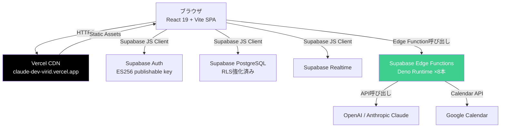

# focus-you インフラ基盤 意思決定レポート（2026-04-17）

**対象プロダクト**: focus-you（React 19 + Vite + TypeScript SPA / Supabase / Vercel）
**作成日**: 2026-04-17
**作成**: HD共通資料制作部
**読者**: 社長（意思決定者本人）
**ステータス**: review（社長レビュー待ち）

---

## 0. エグゼクティブサマリ（30秒で読める）

### 結論: **「シナリオA：学習効果最大化」を推奨する**

focus-you 本体は Vercel のまま維持し、**Azure Static Web Apps でサブPJを構築して大企業DX知識を積む**。Cloudflare Pages を staging に並走させてコスト保険を確保する。

この結論を1行で言うと：「動いているものを壊さず、学習の場を別に立て、3つのクラウドに少しずつ触れるコストで最大の学習価値を得る」。

---

### 4候補 × 7観点 総合評価マトリクス

| 評価軸 | Vercel | Cloudflare | AWS | Azure |
|-------|-------|-----------|-----|-------|
| ①現状適合性（focus-youをそのまま動かせるか） | **◎** | ○ | △（Deno→Node書換必要） | △（同左） |
| ②価格（個人開発フェーズ） | $20/月（Pro） | $0〜$5/月 | $0〜$2/月 | $0/月 |
| ③学習価値（身につく知識の市場性） | △（Next.js文脈に限定） | ○（Edge/WAF/Zero Trust） | ◎（エンプラ案件で最多） | **◎**（日本市場シェア49%） |
| ④大企業DX通用度 | △ | ○ | ○ | **◎** |
| ⑤セキュリティ標準装備度 | △（WAFはEnterprise限定） | **◎**（DDoS無制限・Free含む） | ○（自分で組む必要） | ○（デフォルトが親切） |
| ⑥開発者体験 | **◎**（ゼロ設定） | ○ | △（設定多め） | ○ |
| ⑦focus-you Deno EF互換性 | **◎**（そのまま動く） | ○（Workers移行は可能） | ✗ | ✗ |

**総合**: 現状維持ならVercel一択。学習軸ならAzure主軸。コスト最適ならCloudflare。3つを組み合わせるのがシナリオA。

---

### 価格レンジ（シナリオ別）

| 段階 | 個人開発（現状） | 100 MAU | 1,000 MAU | バズ時（5TB帯域） |
|------|---------------|---------|----------|----------------|
| **シナリオA推奨構成** | $20〜$25/月 | $20〜$30/月 | $25〜$50/月 | $25/月（Cloudflare側で受け止め） |
| Vercel Pro単独 | $20/月 | $20/月 | $96+/月 | **$620/月** |
| Cloudflare単独 | $5/月 | $5〜$10/月 | $10〜$15/月 | $5/月 |
| Azure単独 | $0〜$9/月 | $9〜$15/月 | $15〜$50/月 | $35+/月 |

---

### 次の3アクション

1. **今週中**: Vercel Usage ダッシュボードで現在の帯域・Functions呼び出し実績を確認する
2. **今月中**: §7の意思決定問い（5問）に自分の言葉で答えを出す
3. **2週間以内**: シナリオAを選ぶなら、Azure 無料アカウントを開設し Static Web Apps に focus-you をデプロイしてみる（半日工数）

---

## 1. focus-you 現状把握

### 現在のアーキテクチャ



**構成サマリ**:
- フロントエンド: React 19 + Vite SPA を Vercel CDN に配信
- バックエンド: Supabase 8本の Edge Functions（Deno runtime）
  - ai-agent, google-calendar-proxy, news-collect/enrich/learn, diary-embed/rhythm, narrator-update
- 認証: Supabase Auth + GitHub OAuth（ES256 publishable key方式、2026年対応済み）
- DB: Supabase PostgreSQL with pgvector（RLS全テーブル適用済み）

---

### 移行時のクリティカルな制約

**最重要: Deno Edge Function の制約**

現在の8本の Edge Function は Deno runtime で動いている。AWS Lambda や Azure Functions に「そのまま」移行することはできない。移行する場合は Node.js/TypeScript に書き換えが必要で、推定工数は1本あたり2〜8時間、計16〜64時間の書き換えコストが発生する。

この制約が意味するのは「インフラを丸ごと AWS/Azure に移すのはコストが高すぎる」ということ。だからこそ、**focus-you 本体は維持しながら、AWS/Azure は学習用サブPJで触る**という戦略が合理的になる。

| 制約 | 影響 | 対策 |
|------|------|------|
| Deno Edge Function はAWS Lambda互換なし | AWS/Azure丸ごと移行で書換必要 | 本体はVercel/Cloudflare維持、AWS/Azureは別PJで学ぶ |
| Supabase Auth のES256 publishable key | ゲートウェイ検証NGのため関数内検証が必要（実装済み） | 現状維持（移行すると認証設計が大幅に変わる） |
| Supabase Realtime（WebSocket） | AWS/Azureで再構築すると工数膨大 | Supabase維持が唯一の現実解 |
| pgvector | AWS RDSで継続可能、Azureも対応 | 移行自体は可能だが、RLSとの統合作業が必要 |

---

## 2. 4候補の比較マトリクス（中核）

### Vercel

- **何者か**: フロントエンドホスティング特化。Next.js の事実上の標準。
- **focus-youに対して**: git push でそのまま動く。Deno EFはSupabaseが持つのでVercelはCDN役に徹しており摩擦ゼロ。
- **ウィークポイント**: 帯域overage（$0.15/GB）とEnterprise限定のOWASP WAFが痛い。Next.js文脈以外の学習価値が薄い。

| 指標 | 数字 |
|------|------|
| Hobby月額 | $0（商用利用不可） |
| Pro月額 | $20/seat + $20 usage credit |
| 帯域（Pro）| 1TB/月、超過 $0.15/GB |
| 帯域（Hobby）| 100GB/月 |
| カスタムFirewallルール数 | Pro: 40個、Enterprise: 1,000個 |
| OWASP Top10 WAF | Enterprise限定 |
| DDoS | 全プラン無料（L3/L4） |
| SOC 2 Type 2 | 取得済み |
| ISO 27001:2022 | 取得済み |

---

### Cloudflare

- **何者か**: CDN/WAF/Zero Trustのグローバルトップ。Workers/R2/D1/D1でフルスタックEdge。
- **focus-youに対して**: Pages に Vite SPA をそのまま移行可能（30分〜1時間）。Deno EFはSupabaseが引き続き担う。静的帯域は無制限。
- **ウィークポイント**: wrangler.toml の設定コストと、ドキュメントの多さ。Bot ML機能はEnterprise限定。

| 指標 | 数字 |
|------|------|
| Workers Free月額 | $0（100Kリクエスト/日） |
| Workers Paid月額 | $5/月（アカウント単位、10M req含む） |
| 静的帯域 | 無制限（全プラン） |
| R2 egress | **$0**（業界異常値） |
| DDoS | 全プラン無制限（業界異常値） |
| WAF（OWASP Top10相当） | **Pro $25/月から**（Vercelと異なり安価） |
| Zero Trust（50ユーザまで） | 無料 |
| FedRAMP | In Process（Vercelは✗） |
| Workers AI（推論リクエスト増） | YoY +4,000%（2026Q4実績） |

---

### AWS

- **何者か**: グローバルシェアNo.1。サービス数200以上。エンタープライズの定番。
- **focus-youに対して**: Deno EFをそのまま動かせる場所がない。Amplify/S3+CloudFrontはフロント静的ホストとして使えるが、バックエンド（EF8本）は全書換が必要。
- **学習価値**: 日本フリーランス案件数は最多。SAA取得で月60〜80万円レンジ。グローバル展開を狙うなら最重要軸。

| 指標 | 数字 |
|------|------|
| S3+CloudFront月額（学習用） | $1〜$2/月 |
| Amplify Hosting（学習用） | 12ヶ月無料枠あり |
| Cognito（〜10K MAU） | 無料 |
| Lambda（〜1M req/月） | 実質無料枠内 |
| AWS WAF | $5/ACL + $1/ルール + $0.6/M req |
| GuardDuty | $10〜$100/月（ログ量依存） |
| SAA取得後フリーランス単価（日本） | 月60〜80万円 |
| 日本クラウドシェア | 31% |

---

### Azure

- **何者か**: 日本市場シェア49%。Microsoft 365連携が最強の武器。金融・公共・大手SIer案件のデファクト。
- **focus-youに対して**: AWSと同様、Deno EFそのままは動かない。ただしStatic Web Apps Freeプランが月$0で、学習用サブPJとして最安値。
- **学習価値**: 日本のエンプラDX案件には最も効く。Entra ID + Microsoft 365連携の実経験は他クラウドで代替できない。

| 指標 | 数字 |
|------|------|
| Static Web Apps（Free）月額 | **$0** |
| Static Web Apps（Standard）月額 | $9/アプリ/月（SLA・1TB帯域・カスタム認証込み） |
| Entra External ID（〜50K MAU） | 無料 |
| Front Door + WAF（Standard） | $35〜/月 |
| Azure Functions（消費プラン） | 無料枠内に収まりやすい |
| AZ-104取得後フリーランス単価（日本） | 月60〜85万円（競合少ない分、専門性評価あり） |
| 日本クラウドシェア | **49%**（グローバルとは逆転） |
| Microsoft 365既存ユーザーへの訴求力 | 圧倒的（日本の大企業の大多数が利用） |

---

## 3. 価格の詳細

### Vercel プラン詳細

| 項目 | Hobby | Pro | Enterprise |
|------|-------|-----|-----------|
| 月額 | $0 | $20/seat（$20 credit込み） | 見積もり |
| 帯域 | 100GB | 1TB | カスタム |
| Edge Requests | 1M/月 | 10M/月 | カスタム |
| 帯域超過単価 | - | **$0.15/GB** | - |
| Function呼び出し超過 | - | $0.60/百万 | - |
| Build時間（Turbo） | 制限あり | $0.126/分 | - |
| カスタムFirewallルール | 3 | 40 | 1,000 |
| OWASP WAF | - | - | **Enterprise限定** |
| 商用利用 | **不可** | 可 | 可 |

**注意点**: Vercel Hobby は商用利用禁止（2024年以降厳格化）。focus-you の商用化前提なら Pro $20/月が最低ライン。Build Turboは実際のビルド時間次第（Vite SPA 2〜3分 × 回数）で嵩む。

出典: [Vercel Pricing](https://vercel.com/pricing)

---

### Cloudflare Workers/Pages 詳細

| 項目 | Workers Free | Workers Paid ($5/月) |
|------|------------|---------------------|
| Workers リクエスト | 100K/日 | 10M/月含む（超過 $0.30/百万） |
| Pages 静的帯域 | **無制限** | **無制限** |
| R2 egress | **$0** | **$0** |
| R2 ストレージ | 10GB | $0.015/GB-月 |
| D1 行読み | 5M/日 | 25B/月含む |
| Workers AI | 10K Neurons/日 | $0.011/1K Neurons |
| KV 読み取り | 100K/日 | 10M/月含む |
| DDoS | 無制限 | 無制限 |

出典: [Workers Pricing](https://developers.cloudflare.com/workers/platform/pricing/) / [R2 Pricing](https://developers.cloudflare.com/r2/pricing/)

---

### AWS 学習用最小構成

| 構成要素 | 月額 | 補足 |
|---------|------|------|
| S3（ホスト）+ CloudFront | $1〜$2/月 | Route 53 $0.50/zone別途 |
| ACM（TLS証明書） | $0 | 無料 |
| Cognito（〜10K MAU） | $0 | 無料枠 |
| Lambda（〜1M req） | $0 | 無料枠 |
| AWS WAF（任意） | $6〜$30/月 | $5/ACL + $1/ルール + $0.6/M req |
| **学習用合計（WAFなし）** | **$1〜$2/月（約150〜300円）** | |
| **学習用合計（WAF込み）** | **$7〜$32/月（約1,050〜4,800円）** | |

**注意**: GuardDuty（脅威検知）を有効化したまま放置すると月$10〜$100の予期しない課金が発生する。Budget アラートを$5/$10/$30の3段階で設定する習慣が必須。

出典: [AWS Amplify Pricing](https://aws.amazon.com/amplify/pricing/) / [CloudFront Pricing](https://aws.amazon.com/cloudfront/pricing/) / [AWS WAF Pricing](https://aws.amazon.com/waf/pricing/)

---

### Azure 学習用最小構成

| 構成要素 | 月額 | 補足 |
|---------|------|------|
| Static Web Apps（Free） | **$0** | SLAなし、学習に最適 |
| Static Web Apps（Standard） | $9/月 | SLA・1TB帯域・カスタム認証込み |
| Entra External ID（〜50K MAU） | $0 | 無料枠（AWSより広い） |
| Azure Functions（消費プラン） | $0〜数ドル | 無料枠内に収まりやすい |
| Front Door + WAF（Standard、任意） | $35〜/月 | 学習段階では不要 |
| **学習用合計（WAFなし）** | **$0（完全無料）** | |

出典: [Azure Static Web Apps Pricing](https://azure.microsoft.com/en-us/pricing/details/app-service/static/)

---

### シナリオ別総額比較

| シナリオ | 個人開発（現状） | 100 MAU | 1,000 MAU | バズ時（5TB帯域） |
|---------|---------------|---------|----------|----------------|
| Vercel Pro単独 | $20 | $20 | $96+（Build Turbo別） | **$620**（帯域overage） |
| Cloudflare Workers Paid | $5 | $5〜$10 | $10〜$15 | **$5**（egress $0のため） |
| AWS（S3+CloudFront+Lambda） | $2〜 | $6〜$28 | $75〜$240 | 帯域依存（要確認） |
| Azure（SWA Standard） | $9 | $9〜$15 | $15〜$60 | Front Door込みで$50〜 |
| **シナリオA推奨**（Vercel本番+Azure学習+CF staging） | $20+$0+$0 = $20 | $20+$0+$5 = $25 | $20+$9+$5 = $34 | CF stagingが受け止め |
| **シナリオB推奨**（Cloudflare本番移行後） | $5 | $5〜$10 | $10〜$20 | $5 |

**重要**: 「バズ時」のVercel単独は$620（約93,000円）が一瞬で飛ぶ。Cloudflare前段かstaging並走で保険をかけることを推奨。

---

## 4. 学習価値の評価

### 各クラウドで身につく知識の市場価値

| クラウド | 身につく主な知識 | 日本市場での需要 |
|---------|--------------|--------------|
| **Vercel** | Next.js最適化、Preview Deploy、Edge Config | Next.jsプロジェクトに付随。単独の案件は少ない |
| **Cloudflare** | WAF設計、Bot対策、Zero Trust、Edge Computing、R2/D1 | エッジ化案件・CDN置換・WAF移行で急拡大。YoY +4,000%の成長 |
| **AWS** | IAM/VPC/Lambda/S3/RDS/CloudTrail、サーバーレス全般 | 日本フリーランス案件数最多。SAA=実質的なクラウドエンジニア証明書 |
| **Azure** | Entra ID（旧AD）、M365連携、Defender、Sentinel、Fabric/Synapse | 日本市場シェア49%。金融・公共・製造・Microsoft 365企業の必須知識 |

---

### 認定資格パスとROI

#### Azure ルート（社長の射程市場 = 日本エンプラDXに最適）

```
AZ-900（基礎・任意）→ AZ-104（Admin、3ヶ月）→ AZ-305（アーキテクト）or AZ-500（セキュリティ）
```

| 認定 | 受験料 | 標準学習期間 | 日本フリーランス単価への影響 |
|------|-------|-----------|--------------------------|
| AZ-900 | $165 | 1〜2週間 | エントリー証明（単独では弱い） |
| AZ-104 | $165 | 2〜3ヶ月 | **月60〜85万円**圏に入れる |
| AZ-305 | $165 | 2〜3ヶ月（AZ-104後） | 設計リード案件、月80〜130万円 |
| AZ-500 | $165 | 2〜3ヶ月（AZ-104後） | 金融・公共セキュリティ案件、月80〜130万円 |

出典: [Azure Certification Roadmap 2026](https://www.myexamcloud.com/blog/azure-certification-roadmap-2026-az900-az104-az305.article)

#### AWS ルート（グローバル・テック企業向けに副軸として）

```
CLF（任意）→ SAA-C03（3ヶ月）→ SAP-C02（上級）or SCS-C03（Security Specialty）
```

| 認定 | 受験料 | 標準学習期間 | 日本フリーランス単価への影響 |
|------|-------|-----------|--------------------------|
| CLF | $100 | 1〜2週間 | 証明にはなるが単独では弱い |
| SAA-C03 | $300 | 2〜3ヶ月 | **月60〜80万円**圏に入れる |
| SAP-C02 | $300 | 3〜6ヶ月（SAA後） | 設計リード・月80〜120万円 |
| SCS-C03（Security） | $300 | 3〜6ヶ月 | セキュリティ専門・月90〜150万円 |

出典: [AWS Certification Roadmap 2026](https://k21academy.com/aws-cloud/aws-certification-roadmap/)

---

### 大企業DX観点での通用度（業界別）

| 業界 | 主要クラウド | 推奨認定 | focus-youで練習できること |
|------|-----------|---------|------------------------|
| **金融（銀行・証券・保険）** | Azure 強い / AWS 併存 | AZ-500、AZ-104 | Entra ID SSO、KMS設計、監査ログ |
| **官公庁・自治体** | Azure（M365・ISMAP） | AZ-104、AZ-305 | Azure Policy、Conditional Access |
| **製造業** | Azure（M365ベース） | AZ-104 | Microsoft 365連携設計 |
| **一般エンプラ（B2B SaaS提供）** | Azure / AWS 両立 | AZ-104 + SAA | SOC 2 readiness、マルチテナント設計 |
| **テック・スタートアップ** | AWS / Cloudflare 強い | SAA + Cloudflare実績 | Workers/R2/D1、Serverlessアーキテクチャ |
| **グローバルSaaS** | AWS 優位 | SAA、SAP | マルチリージョン、CloudFront |

**社長の受託コンサル・フリーランスで日本市場を射程にするなら、Azure主軸 + AWS副軸が最もROI高い**。Cloudflareの実績は「Edgeアーキテクチャを語れる」差別化ポイントになる。

出典: [日本クラウドシェア分析 2026 - DEHA Magazine](https://deha.co.jp/magazine/cloud-2026/) / [Programming Helper 2026](https://www.programming-helper.com/tech/cloud-computing-market-share-2026-aws-azure-google-cloud-analysis)

---

## 5. セキュリティのロードマップ

### focus-you 現状のセキュリティ診断

| 領域 | 現状 | 評価 |
|------|------|------|
| Supabase RLS | 全テーブル適用済み | 完了 |
| APIキー管理 | Edge Function env経由（ブラウザに露出しない設計） | 完了 |
| Edge Function認証 | verify_jwt=false + 関数内getUser()検証（ES256対応） | 完了 |
| TLS通信暗号化 | Vercel/Supabaseが自動でTLS 1.3 | 完了 |
| データat rest暗号化 | SupabaseがAES-256で自動暗号化 | 完了 |
| **CSP（Content Security Policy）** | vercel.jsonに基本ヘッダのみ、CSP未設定 | **要対応** |
| **MFA** | Supabase Authの機能はあるが有効化要確認 | **要確認** |
| **監査ログ** | Supabase auth eventsのみ（カスタムログなし） | **要改善** |
| **Threat Model（STRIDE）** | 未作成 | **要作成** |
| **プライバシーポリシー** | 未整備 | **商用化前必須** |
| WAF（本格） | Vercel Pro標準のFirewallのみ（OWASP WAFなし） | △（Phase 2で要検討） |
| アプリ層E2EE | 未実装（Supabase側で日記内容を復号可能） | △（商用化差別化で検討） |
| 個人情報保護法対応 | 未整備 | **商用化前必須** |
| GDPR（データ削除要求） | 実装未確認 | **EU展開前に必要** |

---

### Phase 1: 即対応（1〜2週間）

**目標**: 個人開発として恥ずかしくない最低ラインへ

| タスク | 工数目安 | 学習価値 | 実用価値 |
|-------|---------|---------|---------|
| CSPヘッダ設定（vercel.jsonに追加） | 2〜4時間 | ◎（XSS防御の体験） | ◎ |
| MFA有効化（Supabase Auth設定確認） | 2時間 | ○ | ◎ |
| STRIDE脅威モデル作成（DFD+脅威列挙1枚） | 4〜8時間 | ◎（大企業DXで語れる） | ○ |
| プライバシーポリシー草案 | 8〜16時間 | ○ | ◎（商用化必須） |
| アプリログ収集の仕組み設計 | 4〜8時間 | ◎ | ◎ |
| Dependabot/Snyk依存スキャン確認 | 2時間 | ○ | ◎ |

---

### Phase 2: 商用化前（1〜3ヶ月）

**目標**: 個人ユーザに展開できる安全性 + 大企業視点で語れる経験

| タスク | 工数目安 | 学習価値 | 実用価値 |
|-------|---------|---------|---------|
| Cloudflare前段配置（WAF + Bot Protection） | 8〜16時間 | ◎（即DX案件で語れる） | ◎ |
| Cloudflare Zero Trust 50ユーザ無料枠体験 | 8時間 | ◎ | ○（社内サービス保護） |
| Doppler/Infisicalでシークレット一元管理 | 8〜16時間 | ◎（エンプラ標準の作法） | ○ |
| GDPR/個人情報保護法対応（削除API、Cookie同意） | 40〜80時間 | ○ | ◎（必須） |
| アプリ層E2EEのPoC（日記本文のみ） | 40〜80時間 | ◎（商用化差別化） | ◎ |
| OWASP Top 10に沿った自前Pentest | 40時間 | ◎ | ◎ |
| Azure AZ-104学習と同時並行でサブPJ構築 | 200時間 | ◎（認定+実務=最強） | ◎（大企業案件獲得） |

---

### Phase 3: スケール時（6ヶ月以降）

**目標**: エンプラB2B案件で「実績ある」と言えるレベル

| タスク | 工数目安 | 学習価値 |
|-------|---------|---------|
| Supabase Enterprise移行（Private Endpoint、ISO27001統制） | 移行作業 | ◎ |
| SIEM導入（Datadog Cloud SIEM or Microsoft Sentinel） | 80〜160時間 | ◎ |
| SOC 2 Type 2取得 | 6〜12ヶ月 + 200万〜500万円 | ◎ |
| AZ-305またはAZ-500受験 | 200〜300時間 | ◎ |
| CISSP受験（5年実務経験後） | 300時間 | ◎（シニア証明） |
| Bug Bounty Program開設 | 設計40時間 + 報奨金 | ◎ |

**「過剰投資にならない」ライン**: 現フェーズ（個人開発・社長個人利用）では HSM/BYOK/HYOK、Splunk Enterprise、マルチアカウントAWS Organizations、外部委託Pentest（30〜100万円）は不要。Phase 1〜2で十分なセキュリティ姿勢を示せる。

---

## 6. 推奨シナリオ（3つ）

---

### シナリオA: 学習効果最大化（推奨）

**向いている社長**: 「大企業DXで戦える知識が最優先。focus-youが商用化するかどうかはまだ決まっていない。週10時間以上を学習に使える」

**戦略**:
- **focus-you本体はVercel Pro維持**（$20/月）。今動いているものを壊さない
- **Cloudflare Pages を staging/preview 環境に並走**（$0、Workers Freeで十分）。バズ時の保険とCloudflare知識獲得を兼ねる
- **Azure Static Web Apps Freeで学習用サブPJを構築**（$0〜$9/月）。日本エンプラDX向けの「Microsoft 365連携感情分析ダッシュボード」を作ってみる

**認定パス**:
```
AZ-900（2週間・任意）→ AZ-104（3ヶ月）→ AZ-305 or AZ-500（3〜6ヶ月）
   副軸: Cloudflare Workers実績 → CLF or SAA（AWS教養として）
```

**6ヶ月後の到達点**:
- AZ-104または AZ-305保有者として日本エンプラDX案件に名乗り出られる
- Cloudflare Workers/WAF/Zero Trustの実経験で「Edgeアーキテクチャを語れる」
- focus-youの商用化判断が「実際のインフラコスト・学習価値の手触りベース」でできる
- フリーランス月単価60〜100万円圏に届くスキルセット形成中

**月額コスト目安**:
| 用途 | 月額 |
|------|-----|
| Vercel Pro（focus-you本番） | $20 |
| Cloudflare Workers Free（staging） | $0 |
| Azure Static Web Apps Free（学習サブPJ） | $0〜$9 |
| **合計** | **$20〜$29**（約3,000〜4,350円） |

---

### シナリオB: 商用化スピード最大化

**向いている社長**: 「6ヶ月以内にMRRを立てたい。インフラ学習よりユーザー獲得に時間を使いたい。コストを絞りたい」

**戦略**:
- **focus-youをCloudflare Pagesに段階移行**（Vercel→Cloudflare、1〜2日の移行作業）
- 帯域コスト$0でバズ耐性を確保し、商用化のコスト予測をシンプルにする
- 認定は最小限（CLFまたはAZ-900のみ、どちらか）
- 空いた時間とコストを全部「ユーザー獲得」に使う

**移行手順（focus-you Vercel → Cloudflare Pages）**:
```bash
# 1. Cloudflare Pages ダッシュボード → GitHub連携 → focus-youリポジトリ選択
# 2. ビルド設定: npm run build → dist/
# 3. public/_redirects に「/* /index.html 200」を追記（SPA対応）
# 4. 環境変数をCloudflare Pagesにコピー（VITE_SUPABASE_URL等）
# 5. preview URLで動作確認
# 6. カスタムドメインをCloudflareに向け直す
# 7. Vercelは1〜2週間並行運用してから削除
```

**月額コスト目安**:
| 用途 | 月額 |
|------|-----|
| Cloudflare Workers Paid（本番） | $5 |
| 学習・認定コスト | 最小限 |
| **合計** | **$5**（約750円） |

**注意点**: Cloudflare移行は技術的には簡単だが、「DNSの切り替えミス」「新環境でのSupabase Auth callback URL更新忘れ」に注意。1〜2週間の並行運用を省略しない。

---

### シナリオC: 並行実験（折衷）

**向いている社長**: 「学習もしたいし商用化も進めたい。でもいきなり全移行は怖い。週5〜10時間ほど確保できる」

**戦略**:
- **Vercel本番維持**（$20/月）
- **Cloudflare staging**（$0〜$5/月）でCDN切り替えの手触りを習得
- **AWS/Azure の学習はサブPJで月1〜2回触る**（$0〜$9/月）
- 4つ全部に薄く触れて「どれが自分に合うか」を体感してから3ヶ月後に本命を決める

**月額コスト目安**:
| 用途 | 月額 |
|------|-----|
| Vercel Pro（本番） | $20 |
| Cloudflare Workers Free（staging） | $0 |
| Azure/AWS 学習用 | $0〜$9 |
| **合計** | **$20〜$29**（約3,000〜4,350円） |

**リスク**: 「4つ全部に少しずつ」は「4つ全部が浅い」になりやすい。3ヶ月後に1つに絞る意思決定が必須。

---

## 7. 意思決定のための問い（社長に投げる5問）

これらに答えることで、シナリオA/B/Cのどれが「今の社長に合うか」が明確になる。答えは完璧でなくてよい。「わからない」なら「わからない」と書いておいて、それ自体を意思決定の材料にする。

---

**問い1: どの業界の大企業DXを主戦場にするか？**

選択肢と示唆:
- 金融（銀行・証券・保険） → Azure AZ-500が最重要。BYOK/KMS設計の学習も必要
- 官公庁・自治体 → Azure必須（Microsoft 365・ISMAP）。グラウドアーキテクト知識が効く
- 製造業（M365ユーザー中心） → Azure AZ-104で十分なエントリーが取れる
- 一般エンプラB2B SaaS → Azure + AWS両立。SOC 2 readinessが足切りライン
- テック・スタートアップ → AWS優先。Cloudflareの実績も喜ばれる

今すぐ決まらなくても「一番縁がある人脈はどの業界か」で決めてよい。

---

**問い2: 商用化のタイムラインはどう考えているか？**

選択肢と示唆:
- 3ヶ月以内にMRRを立てたい → シナリオB（Cloudflare移行+コスト最小化）
- 6ヶ月以内に初ユーザーを10人獲得したい → シナリオA or C（並行開発）
- 1年以上かけてしっかり作る → シナリオA（学習と商用化を両立）
- 商用化より自分の学習プラットフォームとしての位置づけが強い → シナリオA

---

**問い3: 学習投資の時間予算は週何時間か？**

- 5時間以下 → AZ-900止まり、もしくは認定は後回し。Cloudflare staging構築（半日）だけやる
- 10時間 → AZ-104を3ヶ月で取れる現実的なペース
- 20時間以上 → AZ-104 + サブPJ + Cloudflare実験を同時並走できる

---

**問い4: 認定取得を「進捗指標」にするか、それとも「実績ベース」でいくか？**

どちらも正解だが組み合わせが最強:
- 認定のみ → 「資格あるけど実務は?」と聞かれる
- 実績のみ → 大企業の調達RFPの「保有資格者数」の足切りを越えられないことがある
- **認定 + 個人PJ実績（ブログ/GitHub）が最強**。focus-youはその実績の素材になる

---

**問い5: focus-you 本体は「動くこと優先」か「学習の素材」か？**

- 動くこと優先 → 今のVercel+Supabaseをそのまま使い続ける。シナリオB or C
- 学習の素材 → 少し壊す覚悟で移行実験をする。シナリオA or C
- 両立 → 本番は動かしながら、stagingで実験する。シナリオA

---

## 8. 次のアクション（具体）

### 今週中にやること

- [ ] **Vercel Usageダッシュボードを開く**: Settings → Usage。月次の帯域・Function呼び出し・Build時間の実績を確認する。スクリーンショットを撮っておく（意思決定の根拠になる）
- [ ] **§7の5問に自分の言葉で答える**: スマホのメモでいい。箇条書きでいい。「わからない」でいい
- [ ] **シナリオA/B/Cのどれが響くか決める**: 完全に決まらなくても「AかCかな」くらいで次に進む

---

### 今月中にやること

**シナリオAを選んだ場合**:
- [ ] Azure無料アカウントを開設する（クレジットカード必要だが$200の無料クレジットあり）
- [ ] Azure Static Web AppsのFreeプランにfocus-youをデプロイしてみる（半日工数）。本番ではないのでリスクなし
- [ ] Microsoft Learnでアカウントを作り、AZ-104のラーニングパスを開始する
- [ ] Cloudflareアカウントを作成（クレジットカード不要）、focus-youをCloudflare Pages staging にデプロイする（1〜2時間）

**シナリオBを選んだ場合**:
- [ ] Cloudflare Pagesにfocus-youをデプロイしてpreview URLで動作確認する
- [ ] Supabase Auth callback URLをCloudflareのpreview URLに追加する（Supabase Dashboard → Auth → URL Configuration）
- [ ] DNSの段階移行計画を立てる（Vercel → Cloudflare、1〜2週間の並行運用）

---

### 3ヶ月以内にやること

- [ ] **AZ-104 or SAA-C03 受験**（シナリオA: Azure、シナリオB: どちらでも）
- [ ] **Phase 1セキュリティ対応完了**（CSP、MFA、Threat Model、プライバシーポリシー）
- [ ] **学習成果をブログ/Zennに1本公開**（focus-youのインフラ選択の経緯でも、AZ-104学習記録でも）。公開することで「実績」になる

---

## 付録: 参考リンク・出典

### Vercel 公式
- [Vercel Pricing](https://vercel.com/pricing) — 最新のプラン・overage単価
- [Vercel Hobby Plan](https://vercel.com/docs/plans/hobby) — 商用利用禁止の詳細
- [Vercel Security](https://vercel.com/security) — SOC2/ISO27001
- [Vercel Firewall docs](https://vercel.com/docs/vercel-firewall) — WAFカスタムルール数
- [Vercel Compliance](https://vercel.com/docs/security/compliance) — 認定一覧

### Cloudflare 公式
- [Cloudflare Plans](https://www.cloudflare.com/plans/) — Free/Pro/Business比較
- [Workers Pricing](https://developers.cloudflare.com/workers/platform/pricing/) — Paid $5/月の含まれリソース
- [R2 Pricing](https://developers.cloudflare.com/r2/pricing/) — egress $0の根拠
- [Cloudflare WAF](https://developers.cloudflare.com/waf/get-started/) — OWASP WAF設定方法
- [Cloudflare Zero Trust](https://www.cloudflare.com/products/zero-trust/) — 50ユーザ無料の詳細
- [Pages + React デプロイ](https://developers.cloudflare.com/pages/framework-guides/deploy-a-react-site/) — Vite SPA移行手順
- [Cloudflare Trust Hub](https://www.cloudflare.com/trust-hub/compliance-resources/) — SOC2/ISO27001/FedRAMP

### AWS 公式
- [AWS Amplify Pricing](https://aws.amazon.com/amplify/pricing/)
- [CloudFront Pricing](https://aws.amazon.com/cloudfront/pricing/)
- [Lambda Pricing](https://aws.amazon.com/lambda/pricing/)
- [AWS WAF Pricing](https://aws.amazon.com/waf/pricing/)
- [GuardDuty Pricing](https://aws.amazon.com/guardduty/pricing/) — 課金事故に注意
- [AWS Budgets](https://aws.amazon.com/aws-cost-management/aws-budgets/) — $5/$10/$30アラート設定を必ず

### Azure 公式
- [Azure Static Web Apps Pricing](https://azure.microsoft.com/en-us/pricing/details/app-service/static/)
- [Azure Container Apps Pricing](https://azure.microsoft.com/en-us/pricing/details/container-apps/)
- [Azure Front Door Pricing](https://azure.microsoft.com/en-us/pricing/details/frontdoor/)
- [Microsoft Learn（無料・日本語）](https://learn.microsoft.com/ja-jp/) — AZ-104ラーニングパス

### 認定・市場価値
- [Azure Certification Roadmap 2026](https://www.myexamcloud.com/blog/azure-certification-roadmap-2026-az900-az104-az305.article)
- [AWS Certification Roadmap 2026](https://k21academy.com/aws-cloud/aws-certification-roadmap/)
- [日本クラウドシェア 2026 - DEHA Magazine](https://deha.co.jp/magazine/cloud-2026/)
- [AWSフリーランス単価 2026 - bizdev-tech](https://bizdev-tech.jp/aws-freelance/)
- [クラウドエンジニア単価 - xnetwork](https://www.xnetwork.jp/contents/cloud-engineer-unitprice)

### セキュリティ参考資料
- [STRIDE脅威モデリングガイド](https://www.practical-devsecops.com/what-is-stride-threat-model/)
- [LINDDUN プライバシー脅威モデリング](https://linddun.org/)
- [Supabase セキュリティベストプラクティス](https://www.leanware.co/insights/supabase-best-practices)
- [BYOK vs HYOK（暗号鍵モデル）](https://cpl.thalesgroup.com/blog/encryption/cloud-encryption-key-management-byok-hyok)

### Vercelのoverage事例（価格リスク理解のために）
- [$46,485の静的サイト事例（極端例）](https://medium.com/@gsoumyadip2307/46-485-for-a-static-website-vercel-pricing-is-getting-wild-35c4d61a89a9)
- [Vercel 隠れコストの解説 - Schematic](https://schematichq.com/blog/vercel-pricing)

### 参照した調査レポート（同シリーズ）
- `vercel-vs-cloudflare.md` — Vercel vs Cloudflare詳細比較（価格・セキュリティ・DX）
- `aws-vs-azure-for-dx.md` — AWS vs Azure 大企業DX観点比較（認定・市場シェア・案件単価）
- `security-architecture.md` — focus-youセキュリティアーキテクチャ調査と移行戦略
- `07-focus-you-production-platform.md` — データ基盤（Snowflake/Databricks/Fabric）検討（Supabase維持が結論）

---

```yaml
# handoff
handoff:
  - to: secretary
    context: "本レポートを社長に提示し、シナリオA/B/Cの選択と§7の5問への回答を促す。意思決定が出たらsupabase activity_logとsecretary/notesに記録する"
    tasks:
      - "本レポートの内容を社長に届け、シナリオ選択を依頼する"
      - "§7の5問を壁打ちセッションのアジェンダとして提示する"
      - "意思決定が出たら 2026-04-17-decisions.md に記録する"
  - to: pm
    context: "社長のシナリオ選択確定後に実行タスクをチケット化する"
    tasks:
      - "シナリオA選択の場合: Azureアカウント開設・SWA staging構築・AZ-104学習開始をタスク化"
      - "シナリオB選択の場合: Cloudflare Pages本番移行（DNS段階切り替え）タスク化"
      - "シナリオ問わず: Phase 1セキュリティ対応（CSP・MFA・Threat Model・プライバシーポリシー）を2週間スプリントでタスク化"
      - "artifacts テーブルにこのレポートを登録（title: 'focus-youインフラ基盤選定レポート 2026-04'）"
```
