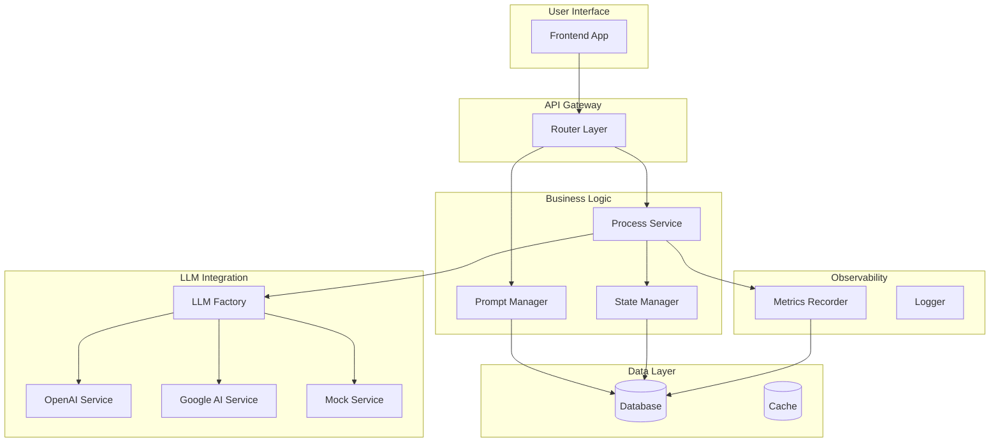

# LLM System Framework - 設計書概要

> **目的**: LLM を活用したシステムを構築するための汎用フレームワーク設計書

## 1. フレームワーク概要

本フレームワークは、LLM（Large Language Model）を活用した業務システムを効率的に構築するための設計パターンとコンポーネントを提供します。

### 1.1 適用可能なユースケース

| ドメイン | 例 |
|---------|-----|
| 設計支援 | 回路設計、建築設計、システム設計 |
| 文書生成 | レポート、提案書、技術文書 |
| コード生成 | コード補完、テスト生成、リファクタリング |
| データ分析 | レポート生成、インサイト抽出 |
| カスタマーサポート | FAQ生成、チャットボット |
| コンテンツ制作 | マーケティング、教育コンテンツ |

### 1.2 フレームワークの特徴

```
┌─────────────────────────────────────────────────────────────┐
│                    Core Principles                          │
├─────────────────────────────────────────────────────────────┤
│  1. Multi-Provider LLM 対応（OpenAI, Google AI, etc.）      │
│  2. プロンプト管理のバージョニングと最適化                   │
│  3. プロセス駆動のパイプライン設計                          │
│  4. 開発時 Mock モードによる API コスト削減                  │
│  5. トークン使用量・コストの可観測性                        │
│  6. DB 抽象化（開発: SQLite / 本番: PostgreSQL）            │
└─────────────────────────────────────────────────────────────┘
```

---

## 2. 設計書一覧

| # | 設計書 | 概要 | 対象読者 |
|---|-------|------|---------|
| 01 | [System Architecture](./01-SYSTEM-ARCHITECTURE.md) | 全体構成、レイヤー分離 | アーキテクト、全開発者 |
| 02 | [LLM Integration](./02-LLM-INTEGRATION.md) | LLM 統合、Provider 抽象化 | バックエンド開発者 |
| 03 | [Prompt Management](./03-PROMPT-MANAGEMENT.md) | プロンプト設計、レジストリ | プロンプトエンジニア、バックエンド |
| 04 | [Process Pipeline](./04-PROCESS-PIPELINE.md) | 状態管理、依存関係 | バックエンド開発者 |
| 05 | [Data Model](./05-DATA-MODEL.md) | DB 設計、型抽象化 | バックエンド開発者 |
| 06 | [API Design](./06-API-DESIGN.md) | REST API 設計規約 | バックエンド、フロントエンド |
| 07 | [Frontend Integration](./07-FRONTEND-INTEGRATION.md) | フロントエンド連携 | フロントエンド開発者 |
| 08 | [Observability](./08-OBSERVABILITY.md) | メトリクス、ログ、トレース | SRE、全開発者 |
| 09 | [Configuration](./09-CONFIGURATION.md) | 環境変数、設定管理 | インフラ、全開発者 |
| 10 | [Testing Strategy](./10-TESTING-STRATEGY.md) | テスト戦略、Mock 活用 | QA、全開発者 |

---

## 3. アーキテクチャ全体像

```
┌──────────────────────────────────────────────────────────────────────┐
│                         Frontend Layer                                │
│              (Next.js / React / Vue / etc.)                          │
│  ┌────────────────┐  ┌────────────────┐  ┌────────────────┐         │
│  │  Process UI    │  │  Prompt Admin  │  │  Metrics View  │         │
│  └────────────────┘  └────────────────┘  └────────────────┘         │
└────────────────────────────┬─────────────────────────────────────────┘
                             │ REST API (JSON)
┌────────────────────────────▼─────────────────────────────────────────┐
│                         Backend Layer                                 │
│                      (FastAPI / Express / etc.)                       │
│  ┌──────────────────────────────────────────────────────────────┐   │
│  │                      Router Layer                             │   │
│  │   /projects  /processes  /prompts  /metrics  /health         │   │
│  └──────────────────────────────────────────────────────────────┘   │
│  ┌──────────────────────────────────────────────────────────────┐   │
│  │                      Service Layer                            │   │
│  │  ┌─────────────┐  ┌─────────────┐  ┌─────────────────────┐   │   │
│  │  │ProcessService│  │PromptService│  │ MetricsRecorder    │   │   │
│  │  └─────────────┘  └─────────────┘  └─────────────────────┘   │   │
│  │  ┌─────────────────────────────────────────────────────────┐ │   │
│  │  │              LLM Service Layer                          │ │   │
│  │  │  ┌──────────┐  ┌──────────┐  ┌──────────┐  ┌────────┐  │ │   │
│  │  │  │  OpenAI  │  │ Google   │  │ Anthropic│  │  Mock  │  │ │   │
│  │  │  └──────────┘  └──────────┘  └──────────┘  └────────┘  │ │   │
│  │  └─────────────────────────────────────────────────────────┘ │   │
│  └──────────────────────────────────────────────────────────────┘   │
│  ┌──────────────────────────────────────────────────────────────┐   │
│  │                      Model Layer                              │   │
│  │   Project  Process  Execution  Prompt  Metrics                │   │
│  └──────────────────────────────────────────────────────────────┘   │
└────────────────────────────┬─────────────────────────────────────────┘
                             │
           ┌─────────────────┼─────────────────┐
           │                 │                 │
    ┌──────▼──────┐   ┌──────▼──────┐   ┌──────▼──────┐
    │   Database  │   │  LLM APIs   │   │  External   │
    │ SQLite/PG   │   │ OpenAI/etc. │   │  Services   │
    └─────────────┘   └─────────────┘   └─────────────┘
```

---

## 4. コンポーネント関係図



---

## 5. 転用時のカスタマイズポイント

### 5.1 ドメイン固有の変更

| コンポーネント | 変更内容 | 変更箇所 |
|--------------|---------|---------|
| Process 定義 | ドメイン固有のプロセス追加 | `services/process/` |
| Prompt 定義 | ドメイン固有のプロンプト作成 | `prompts/categories/` |
| Data Model | ドメイン固有のエンティティ追加 | `models/` |
| API Routes | ドメイン固有のエンドポイント | `routers/` |

### 5.2 共通コンポーネント（変更不要）

- LLM Service Layer（`services/llm/`）
- Prompt Registry（`prompts/registry.py`）
- State Manager（`services/state_manager.py`）
- Metrics Recorder（`services/metrics_recorder.py`）
- Database Abstraction（`models/base.py`）

---

## 6. 実装ロードマップ

```
Phase 1: Core Infrastructure
├── LLM Integration Layer
├── Database Setup
└── Basic API Structure

Phase 2: Process Framework
├── Process Definition
├── State Management
└── Prompt Registry

Phase 3: Domain Implementation
├── Domain-Specific Processes
├── Custom Prompts
└── Frontend UI

Phase 4: Production Readiness
├── Metrics & Monitoring
├── Testing Coverage
└── Documentation
```

---

## 7. 参照実装

本フレームワークの参照実装として `circuit_diagram` プロジェクトがあります。

```
circuit_diagram/
├── backend/           # FastAPI Backend
│   ├── src/
│   │   ├── services/llm/      # ★ LLM統合層
│   │   ├── services/process/  # ★ プロセス層
│   │   ├── prompts/           # ★ プロンプト管理
│   │   ├── models/            # ★ データモデル
│   │   └── routers/           # API層
│   └── tests/
├── frontend/          # Next.js Frontend
├── shared/            # 共通ユーティリティ
│   └── llm/           # ★ 同期LLMクライアント
└── docs/              # ドキュメント
```

---

## 8. 次のステップ

1. **[01-SYSTEM-ARCHITECTURE.md](./01-SYSTEM-ARCHITECTURE.md)** を読み、全体構成を理解
2. **[02-LLM-INTEGRATION.md](./02-LLM-INTEGRATION.md)** で LLM 統合パターンを学習
3. **[03-PROMPT-MANAGEMENT.md](./03-PROMPT-MANAGEMENT.md)** でプロンプト設計を理解
4. 参照実装（circuit_diagram）のコードを確認
5. 新規ドメインへの転用を開始
